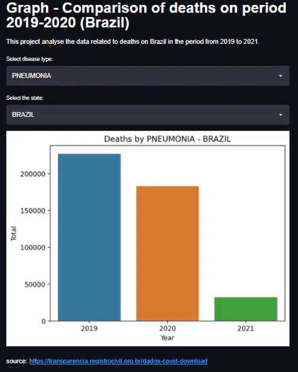

# streamlit_app
This is a project done on the Streamlit module on "Applied Data Science" bootcamp (Alura). While my streamlit account is not activated, I'm leaving a gif presenting the project. When I receive the account, I will deploy the app and update the page. 

On this project we can see the difference through the years of 2019-2021 of the quantity of deaths related to some disease categories. Also, we can use the filters to check the data nationaly or by state. 

